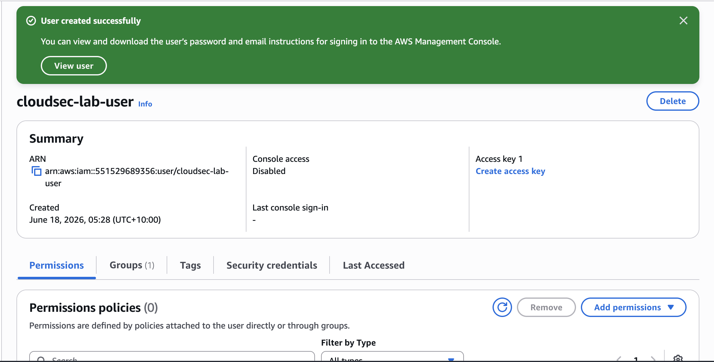

# IAM Fundamentals

## What is IAM?

Identity and Access Management (IAM) controls who can access AWS resources and what actions they can perform.

## Core Concepts

### Users

Represents an individual person or application requiring access to AWS.

### Groups

A collection of users that share permissions.

### Policies

JSON documents that define what actions are allowed or denied.

### Roles

Temporary permissions that can be assumed by users, services or applications.

## Security Principle

### Least Privilege

Grant only the permissions required to perform a task and nothing more.

## Lab Activities

- [ ] Create IAM User
- [ ] Create IAM Group
- [ ] Attach Policy
- [ ] Add User to Group
- [ ] Document Findings

## Notes
## Evidence

### IAM User and Group Creation

**Date:** 18 June 2026

### Objective

Learn the fundamentals of AWS Identity and Access Management (IAM) by creating a user and security group.

### Actions Completed

* Created IAM user: `cloudsec-lab-user`
* Created IAM group: `cloudsec-readonly`
* Added the user to the IAM group
* Explored AWS permission management through groups
* Reviewed the principle of least privilege

### Key Learning

IAM allows administrators to control who can access AWS resources and what actions they can perform. Using groups simplifies permission management and follows AWS best practices.

### Security Principle

**Least Privilege** — users should only receive the permissions required to perform their tasks and nothing more.

### Findings

* Users represent identities that require access to AWS resources.
* Groups allow multiple users to share the same permissions.
* Policies define what actions are allowed or denied.
* Roles provide temporary permissions that can be assumed by users, services, or applications.
* AWS recommends assigning permissions to groups rather than directly to individual users.

### Reflection

This lab provided practical experience with the core IAM components used in AWS environments. Understanding the relationship between users, groups, policies and roles is fundamental for cloud security engineering and secure access management.

